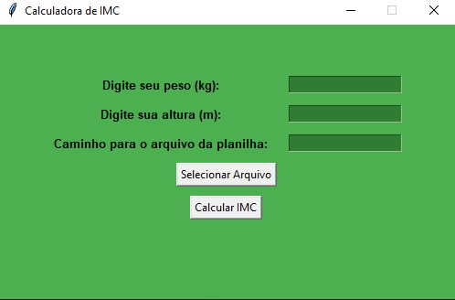

<h1 align="center">:file_cabinet:Calculadora de IMC que coleta dados para uma planilha Excel</h1>

## :memo: Descrição
Projeto de calculadora de IMC que além de realizar o cálculo do IMC com base no peso e na altura, transfere de forma automatizada os dados para uma planilha excel

## :books: Funcionalidades
* <b>Funcionalidades</b>: Aplicativo executável que te solicita o peso, a altura e o caminho do seu arquivo excel. Após inserir as informações, os dados são automaticamente transferidos para a planilha excel que você desejar
* 

## :wrench: Tecnologias utilizadas
* Linguagem Python, juntamente com as bibliotecas TKInter E Openpyxl

## :soon: Implementação futura
* O projeto foi realizado para meu amigo João Paulo, estagiário de nutrição do IFRJ - Campus Pinheiral, onde o mesmo poderá de forma rápida e prática, coletar informações sobre o IMC dos alunos da rede pública de Pinheiral

## :handshake: Colaboradores
<table>
  <tr>
    <td align="center">
      <a href="https://github.com/armandomonteir-o">
         
        
          <b>Armando Monteiro</b>
        
      </a>
    </td>
  </tr>
</table>

## :dart: Status do projeto
* Concluido.
